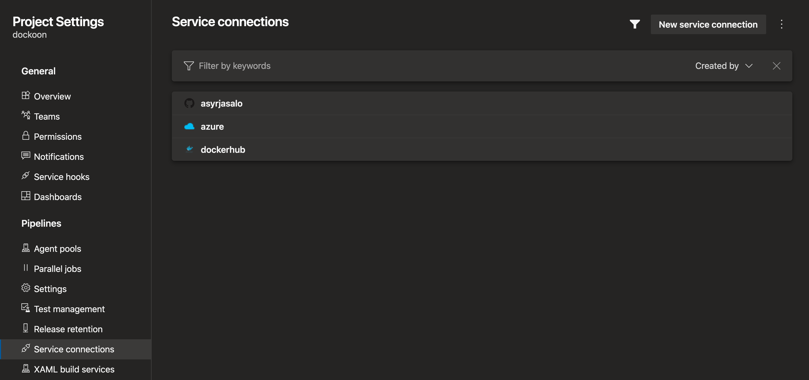

# dockoon

[The Docker images](https://hub.docker.com/r/asyrjasalo/mockoon) include:

- Alpine Linux (`mockoon:alpine`) or Debian Buster (`mockoon:slimbuster`) base
- Node.js 14 running as non-root user
- Latest [@mockoon/cli](https://www.npmjs.com/package/@mockoon/cli)

## Prerequisites

Install development dependencies:

    brew bundle

If casks are not available for your OS, you can download and install Mockoon
[from the official page](https://mockoon.com/#download).

## Usage

Build and run proxy to [jsonplaceholder](https://jsonplaceholder.typicode.com/)
at [:8080](https://localhost:8080) from `Dockerfile`:

    ./dockoon

Use Mockoon GUI to edit `apis.json` copied to the image and re-run the script.

Or fetch `apis.json` over the wire as any `mockoon-cli` arguments are accepted:

    ./dockoon start --data https://file-server/apis.json --index 0 --port 8080

### Customizing Docker environment

Pass variable `BUILD_ARGS` to include additional `docker build` arguments:

    BUILD_ARGS="--build-arg FROM_IMAGE=asyrjasalo/mockoon:slimbuster" \
      ./dockoon

Pass variable `RUN_ARGS` to include additional `docker run` arguments:

    RUN_ARGS="-d -p 4000:4000" \
      ./dockoon start --data apis.json --name jsonplaceholder --port 4000

## Cloud deployment

See `bicep/README.md` for deploying on Azure Container Instances behind an API
Management service.

## Contributing

On Git commit, hooks in `.pre-commit-config.yaml` will be installed and run.

### Building a base image

Alpine Linux:

    docker/build_and_test_image

If succeeded the container will run and output `mockoon-cli` version.

Pass variable `BUILD_ARGS` to override the default `docker build` arguments.

Pass `IMAGE_KIND` to build on non-Alpine Dockerfile. For Debian Buster (slim):

    IMAGE_KIND=slimbuster \
      docker/build_and_test_image

Pass `BUILD_DIR` to override the dir path where `Dockerfile.IMAGE_KIND` is in.

### Pushing the base image

Run `docker login` before running the scripts.

Push the image to your private Docker registry:

    REGISTRY_URL=https://your.azurecr.io \
      docker/tag_and_push_image

Tag and push the image `mockoon:alpine` to [Docker Hub](https://hub.docker.com):

    REGISTRY_URL="$USER" \
      docker/tag_and_push_image

If Debian image was built instead, tag and push the image `mockoon:slimbuster`:

    REGISTRY_URL="$USER" \
    IMAGE_KIND=slimbuster \
      docker/tag_and_push_image

## CI/CD

Steps to create `azure-pipelines.yml` in your own Azure DevOps project:

1. Create the following service connections in the project:
    - GitHub or other repository hosting service
    - Docker Registry
        - If you use DockerHub with MFA, create an access token and use it
    - Azure Resource Manager
        - Use automatically created service principal in the subscription scope

2. Create variable group `prod.env` and define `bicep/prod.env` variables there:

3. Configure in `azure-pipelines.yml` variables for the service connections:
    - `azureServiceConnectionName`
    - `registryServiceConnectionName`
    - `dockerRepositoryUrl`
