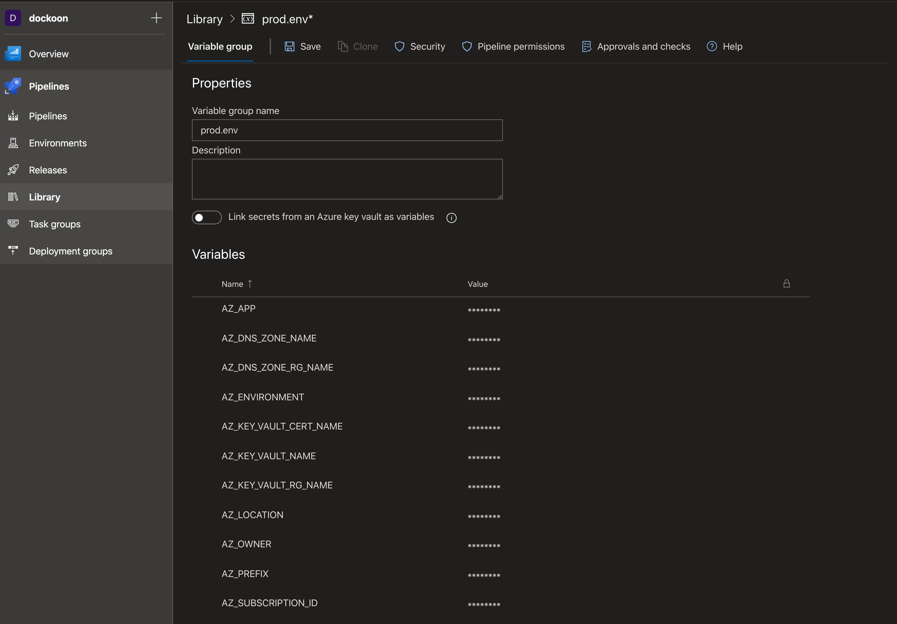

## CI/CD

You can use `azure-pipelines.yml` (in the repo root) to create the
CI/CD pipeline in your Azure DevOps project.

After importing the pipeline from YML file, create the service connections:
- GitHub - created automatically when pthe ipeline is imported from the repo
- Docker registry
    - If you use DockerHub with MFA, create an access token and use it
    - If you use your own private registry, create a dedicated user there 
- Azure Resource Manager
    - Use the automatically created service principal in the subscription scope

Create a variable group named `prod.env` and define variables in
`bicep/prod.env` there.

Configure in `azure-pipelines.yml` variables for the service connection names:
- `azureServiceConnectionName`
- `registryServiceConnectionName`

Configure in `azure-pipelines.yml` variable `dockerRepositoryUrl`. If using
private registry over DockerHub, include the full URL to the repository.
 