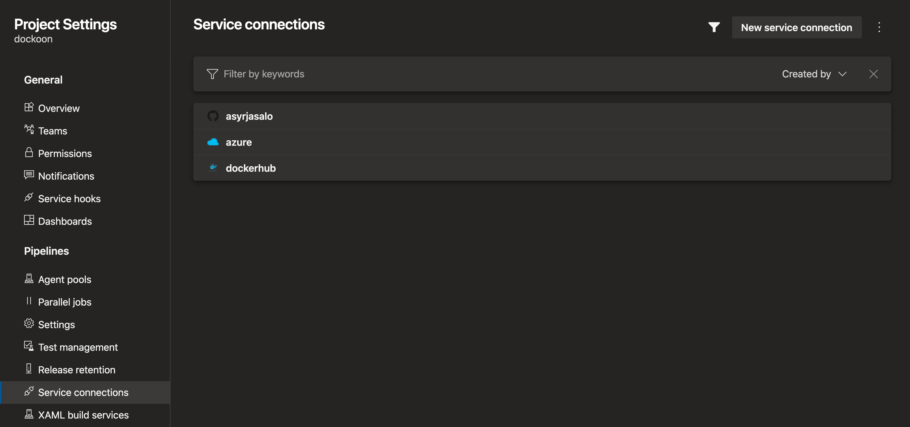

## Creating CI/CD

Create the following service connections in your Azure DevOps project:
- GitHub or similar (created when pipeline is imported from the repo)
- Docker registry
    - If you use DockerHub with MFA, create an access token and use it
- Azure Resource Manager
    - Use the automatically created service principal in the subscription scope

Create variable group `prod.env` and define `bicep/prod.env` variables there

Configure in `azure-pipelines.yml` variables for the service connections:
- `azureServiceConnectionName`
- `registryServiceConnectionName`
- `dockerRepositoryUrl`
